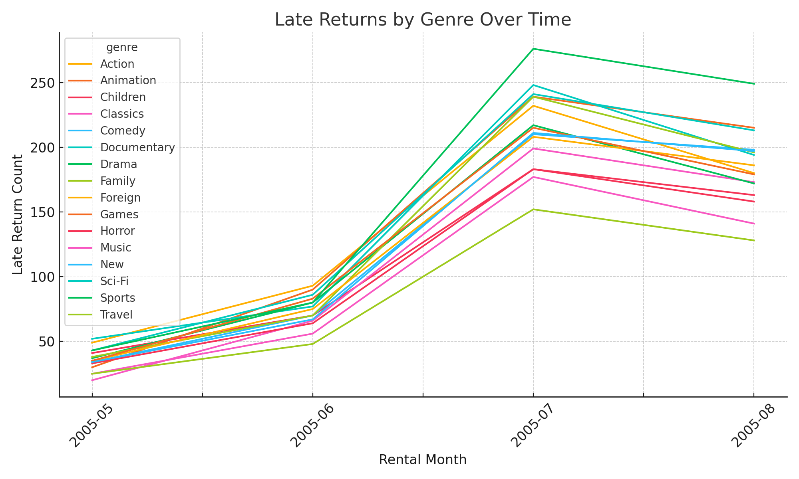
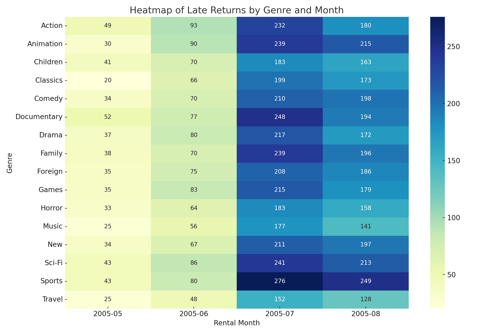
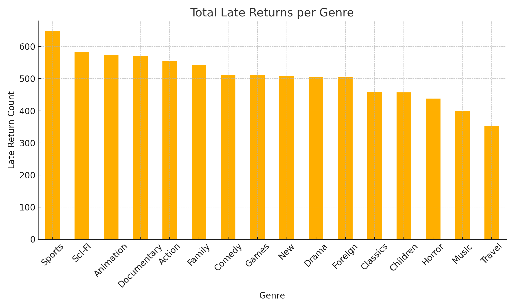

# ChatGPT + SQL Mini Project: Late Movie Returns Analysis
This mini project demonstrates how large language models (LLMs) like ChatGPT can assist with SQL-based data analysis.
The focus is on analyzing DVD movie rental return behavior using structured CSV data and SQL queries.
---
## Project Overview

- Dataset: Fictional DVD rental data (customer ID, genre, late return count, rental month, etc.)
- Goal: Identify which movie genres and months had the most late returns
- Tools used: ChatGPT, SQLite, DBeaver, CSV, SQL
---
##  Key Steps
1. Imported CSV files into a local SQL database
2. Used ChatGPT to:
   - Generate SQL queries
   - Visualize results (bar chart, line chart, heatmap)
   - Summarize insights
3. Analyzed patterns in late returns by:
   - Movie genre
   - Rental month
   - Customer segment
---
## Sample SQL Query
```sql
SELECT genre, SUM(late_return_count) AS total_late_returns
FROM movie_returns
GROUP BY genre
ORDER BY total_late_returns DESC;

Learnings
Practiced prompt engineering for SQL
Combined AI and SQL to accelerate insight
Identified bottlenecks in DVD return behavior

Files
late_returns_by_genre.csv
late_returns_by_month.csv
late_returns_queries.sql
visual_summary.png (optional)

## Visualizations

### Late Returns by Genre Over Time


### Heatmap of Late Returns


### Total Late Returns per Genre


📁 [late_returns_by_genre.csv](late_returns_by_genre.csv)  
📁 [late_returns_queries.sql](late_returns_queries.sql)

Created as part of a training project by Denisa Pitnerová
